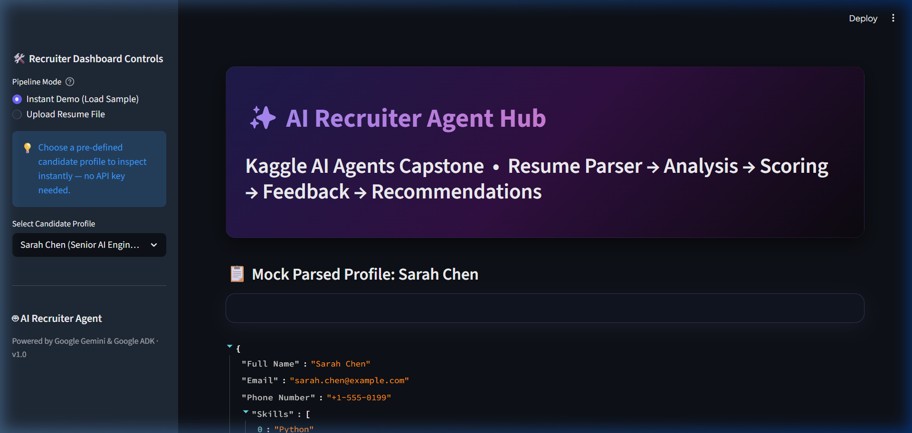
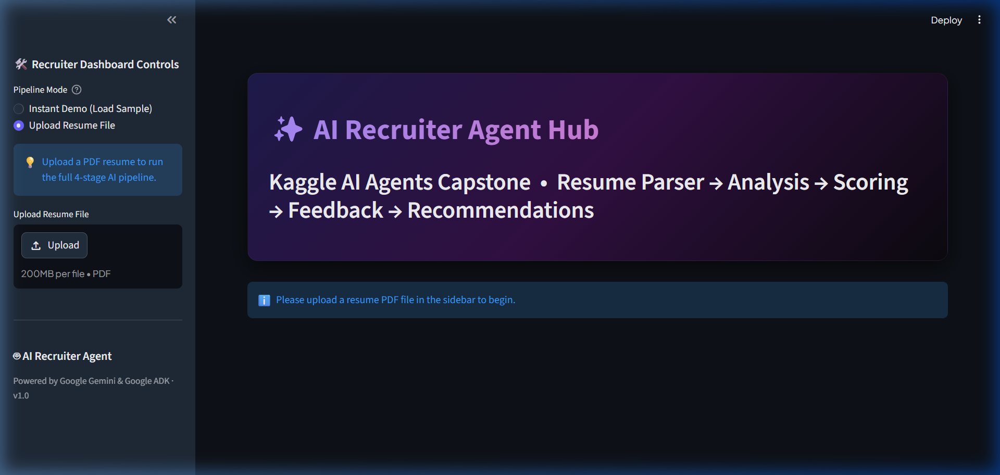
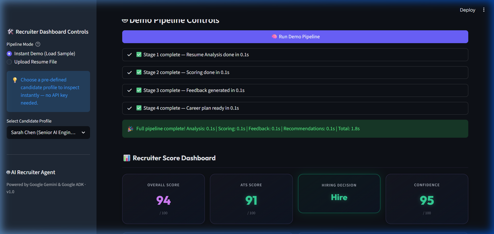
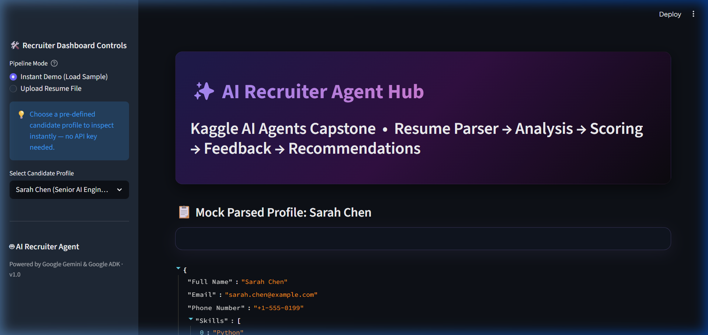
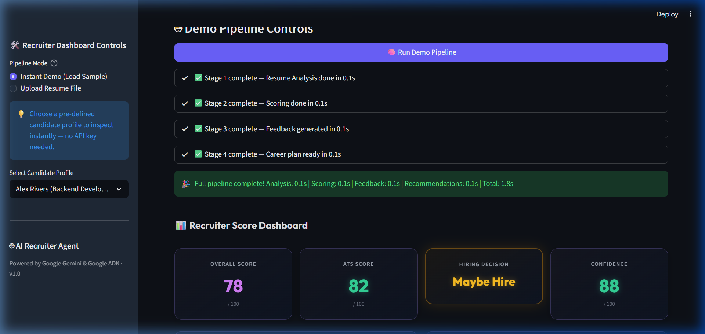
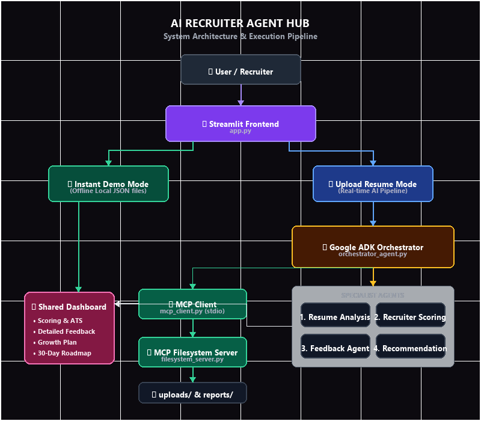
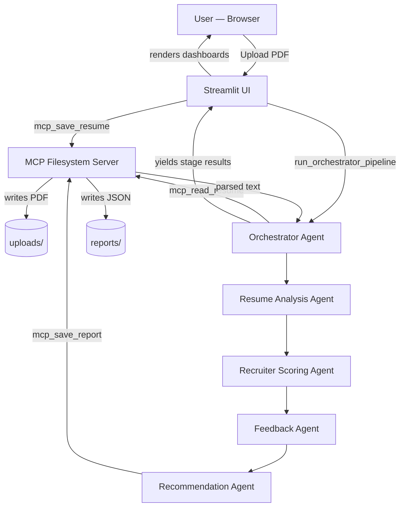

# 🤖 AI Recruiter Agent Hub

> **Kaggle AI Agents Hackathon — Capstone Project**
>
> An intelligent, multi-agent system that analyses candidate resumes end-to-end:
> extracting a structured profile, computing a detailed recruiter-style evaluation,
> generating professional feedback, and delivering a personalised 30-day career
> growth plan — all powered by **Google ADK**, **Gemini**, and **Streamlit**.

---

## 📑 Table of Contents

- [Problem Statement](#-problem-statement)
- [Solution Overview](#-solution-overview)
- [Key Features](#-key-features)
- [Technologies Used](#-technologies-used)
- [Google ADK Architecture](#-google-adk-architecture)
- [MCP Architecture](#-mcp-architecture)
- [Security Features](#-security-features)
- [Folder Structure](#-folder-structure)
- [Installation Guide](#-installation-guide)
- [Environment Variables](#-environment-variables)
- [How to Run](#-how-to-run)
- [Screenshots](#-screenshots)
- [Architecture Diagram](#-architecture-diagram)
- [Future Improvements](#-future-improvements)
- [License](#-license)
- [Acknowledgements](#-acknowledgements)

---

## 🎯 Problem Statement

Recruiters spend an average of **6–7 seconds** scanning a resume before making an initial
judgement. This creates a high-stakes, high-volume bottleneck where even exceptional
candidates are overlooked due to:

- Poor resume formatting that fails ATS (Applicant Tracking System) filters
- Lack of measurable achievements and relevant keywords
- Inconsistent scoring criteria between different recruiters
- No actionable, personalised feedback given to rejected candidates

For candidates, this process is opaque, demoralising, and difficult to improve from.

---

## 💡 Solution Overview

The **AI Recruiter Agent Hub** is a fully automated, AI-driven recruiter pipeline built with
the **Google Agent Development Kit (ADK)** multi-agent framework. It simulates a real
recruiting workflow by decomposing the evaluation into four specialised agents that run
sequentially, each building on the previous agent's output.

The system gives every candidate:

1. **A structured data profile** parsed directly from their PDF resume
2. **Quantitative recruiter and ATS scores** with a hiring decision
3. **Professional feedback** covering strengths, weaknesses, and improvement suggestions
4. **A personalised career growth plan** with recommended skills, courses, certifications,
   projects, interview tips, and a concrete 30-day roadmap

All results are rendered progressively in a premium **Streamlit** dashboard and saved as a
consolidated JSON report through a secure **Model Context Protocol (MCP)** server.

---

## ✨ Key Features

| Feature | Description |
|---|---|
| 📄 **PDF Resume Parsing** | Validates, extracts, and normalises text from PDF files up to 5 MB |
| 🔍 **Resume Analysis Agent** | Extracts name, contact info, education, experience, skills, and projects into a structured JSON schema |
| 🧑‍💼 **Recruiter Scoring Agent** | Scores 5 independent categories, computes an overall and ATS score, and issues a hiring decision |
| 💬 **Feedback Agent** | Generates professional recruiter-style feedback: strengths, weaknesses, recruiter notes, and improvement suggestions |
| 🚀 **Recommendation Agent** | Delivers a personalised career plan: skill gaps, courses, certifications, project ideas, interview prep, and a 30-day roadmap |
| 📊 **Live Dashboard** | Progressive rendering of each pipeline stage in a premium dark-mode Streamlit UI |
| 📁 **MCP File Server** | Secure filesystem operations — upload and report storage via the Model Context Protocol |
| 🎭 **Instant Demo Mode** | Pre-loaded mock candidate profiles for exploring the UI without an API key |
| 📱 **Responsive Design** | CSS `@media` queries and `auto-fit` grids ensure cards stack correctly on mobile and tablet |

---

## 🛠️ Technologies Used

### Core Framework
| Technology | Role |
|---|---|
| **Python 3.11+** | Primary language |
| **Streamlit ≥ 1.35** | Web UI framework |
| **Google ADK ≥ 2.0** | Multi-agent orchestration framework |
| **Google Gemini 2.5 Flash** | Underlying LLM powering all four agents |
| **Model Context Protocol (MCP)** | Secure stdio-based filesystem server/client |

### Data & Validation
| Technology | Role |
|---|---|
| **Pydantic v2** | Strict schema validation for all agent JSON outputs |
| **PyPDF ≥ 4.2** | PDF text extraction and parsing |
| **python-dotenv** | `.env` file loading for API key management |

### Async Compatibility
| Technology | Role |
|---|---|
| **nest_asyncio** | Bridges Streamlit's event loop with `asyncio.run()` inside agents |
| **asyncio** | Async runner for Google ADK `Runner.run_async()` |

---

## 🏗️ Google ADK Architecture

The project uses the **Google Agent Development Kit (ADK)** multi-agent hierarchy.
The Streamlit UI communicates with **one entry point only**: `run_orchestrator_pipeline()`.

```
Streamlit UI
    │
    └──► Orchestrator Agent  (coordinates the pipeline)
              │
              ├── Stage 1: Resume Analysis Agent
              │     └── Gemini 2.5 Flash + ResumeSchema (Pydantic)
              │
              ├── Stage 2: Recruiter Scoring Agent
              │     └── Gemini 2.5 Flash + RecruiterScoreSchema (Pydantic)
              │
              ├── Stage 3: Feedback Agent
              │     └── Gemini 2.5 Flash + FeedbackSchema (Pydantic)
              │
              └── Stage 4: Recommendation Agent
                    └── Gemini 2.5 Flash + RecommendationSchema (Pydantic)
```

### Key Design Decisions

- **Sequential execution**: Each agent receives the outputs of all prior agents, creating a
  compound context that improves accuracy at each stage.
- **Strict output schemas**: Every agent is configured with a Pydantic `output_schema`.
  The ADK enforces this schema, ensuring the UI always receives valid, structured data.
- **Progressive yielding**: The Orchestrator is a Python generator that `yield`s
  `(stage_name, result_dict)` tuples, allowing the UI to render each stage's results
  as they arrive — no waiting for the full pipeline to complete.
- **Single entry point**: `app.py` never imports individual agents directly. All
  orchestration is encapsulated in `orchestrator_agent.py`.

### Agent Configurations

| Agent | Temperature | Rationale |
|---|---|---|
| Resume Analysis | `0.1` | Highly deterministic: parsing, not creativity |
| Recruiter Scoring | `0.2` | Slightly flexible for nuanced reasoning |
| Feedback | `0.3` | Warmer for varied, natural language |
| Recommendation | `0.35` | Creative for varied course/project suggestions |

---

## 🔌 MCP Architecture

The project integrates the **Model Context Protocol (MCP)** for all file I/O operations.
No agent or UI code reads or writes files directly — everything goes through the MCP server.

```
Streamlit UI (sidebar)
    │
    ├──[upload]──► mcp_client.mcp_save_resume()
    │                   │
    │                   └──► MCP Filesystem Server (stdio)
    │                             └── writes to uploads/
    │
Orchestrator Agent
    │
    ├──[read resume]──► mcp_client.mcp_read_resume()
    │                        │
    │                        └──► MCP Filesystem Server
    │                                  ├── validates path
    │                                  ├── calls pdf_parser
    │                                  └── returns extracted text
    │
    └──[save report]──► mcp_client.mcp_save_report()
                             │
                             └──► MCP Filesystem Server
                                       └── writes to reports/
```

### MCP Tools Exposed

| Tool | Directory | Description |
|---|---|---|
| `save_resume` | `uploads/` | Accepts base64-encoded file bytes and writes the PDF |
| `read_resume` | `uploads/` | Reads a PDF, runs the parser, and returns plain text |
| `save_report` | `reports/` | Writes the consolidated JSON evaluation report |
| `read_report` | `reports/` | Reads a previously saved JSON report |
| `list_files` | `uploads/` or `reports/` | Lists visible files in either directory |

### Transport
The client and server communicate over **stdio streams** using the JSON-RPC protocol.
A new MCP session is created and torn down for each tool call, keeping the architecture
stateless and highly decoupled.

---

## 🔒 Security Features

| Mechanism | Implementation |
|---|---|
| **Directory allowlist** | The MCP server only accepts `"uploads"` or `"reports"` as the target directory — all other names raise an immediate error |
| **Path traversal prevention** | `os.path.basename(filename)` strips all directory components from user-supplied filenames before resolving the final path |
| **Path containment check** | `target_path.startswith(base_dir + os.sep)` validates that the resolved absolute path is genuinely inside the allowed directory |
| **File type enforcement** | The PDF parser rejects files whose magic bytes do not begin with `%PDF-` |
| **File size limit** | The PDF parser enforces a hard 5 MB limit before any content is read |
| **Encryption check** | Encrypted/password-protected PDFs are detected and rejected with a clear error message |
| **No direct file access** | Neither `app.py` nor any agent reads or writes files directly — all I/O is gated through the MCP server |

---

## 📂 Folder Structure

```text
kaggle-hackathon/
│
├── agents/                         # Google ADK agent modules
│   ├── orchestrator_agent.py       # Pipeline coordinator + ADK hierarchy root
│   ├── resume_analysis_agent.py    # Stage 1: resume parsing & profile extraction
│   ├── scoring_agent.py            # Stage 2: recruiter scoring + hiring decision
│   ├── feedback_agent.py           # Stage 3: recruiter feedback generation
│   └── recommendation_agent.py    # Stage 4: personalised career growth plan
│
├── mcp/                            # Model Context Protocol integration
│   ├── filesystem_server.py        # FastMCP server — secure file I/O
│   └── mcp_client.py               # Synchronous wrappers around MCP tools
│
├── tools/                          # Shared utility tools
│   └── pdf_parser.py               # PDF validation, extraction, and text cleaning
│
├── uploads/                        # Uploaded PDF resumes (written via MCP)
├── reports/                        # Generated evaluation reports (JSON, via MCP)
│
├── .streamlit/
│   └── config.toml                 # Streamlit dark theme configuration
│
├── app.py                          # Main Streamlit application (UI entry point)
├── requirements.txt                # Python package dependencies
├── .env.example                    # Environment variable template
├── .env                            # Local secrets (git-ignored)
├── .gitignore                      # Standard Python + IDE gitignore rules
└── README.md                       # This file
```

---

## ⚙️ Installation Guide

### Prerequisites

- Python **3.11** or higher
- `pip` package manager
- A valid **Google Gemini API Key** ([Get one free at Google AI Studio](https://aistudio.google.com/))

### Steps

**1. Clone the repository**

```bash
git clone https://github.com/<your-username>/kaggle-hackathon.git
cd kaggle-hackathon
```

**2. Create and activate a virtual environment**

```bash
# Create the environment
python -m venv venv

# Activate on Windows
venv\Scripts\activate

# Activate on macOS / Linux
source venv/bin/activate
```

**3. Install all dependencies**

```bash
pip install -r requirements.txt
```

**4. Configure environment variables**

```bash
# Copy the template
copy .env.example .env        # Windows
cp  .env.example .env         # macOS / Linux
```

Open `.env` and add your API key:

```env
GEMINI_API_KEY=AIzaSy...your_key_here
```

---

## 🔐 Environment Variables

| Variable | Required | Description |
|---|---|---|
| `GEMINI_API_KEY` | **Yes** | Google Gemini API Key obtained from [Google AI Studio](https://aistudio.google.com/) |

> **Note:** If `GEMINI_API_KEY` is not set in `.env`, the application will prompt you to
> enter it in the browser when you first upload a resume. The key is stored in
> `st.session_state` and is never persisted to disk by the app.

---

## ▶️ How to Run

**Start the Streamlit application:**

```bash
streamlit run app.py
```

The app will open automatically in your browser at `http://localhost:8501`.

### Usage

**Option A — Instant Demo (No API Key Required)**

1. In the sidebar, select **"Instant Demo (Load Sample)"**
2. Choose a mock candidate from the dropdown (Sarah Chen or Alex Rivers)
3. The structured profile JSON card renders immediately — explore the UI and layout

**Option B — Full AI Pipeline (API Key Required)**

1. In the sidebar, select **"Upload Resume File"**
2. Upload a text-searchable PDF resume (≤ 5 MB)
3. Enter your Gemini API key when prompted (or pre-set it in `.env`)
4. Click **"🧠 Run Full AI Pipeline"**
5. Watch each of the four agent stages complete progressively:
   - 📄 Stage 1: Resume Analysis
   - 📊 Stage 2: Recruiter Scoring Dashboard
   - 💬 Stage 3: Recruiter Feedback Report
   - 🚀 Stage 4: Career Growth Plan + 30-Day Roadmap
6. Expand **"🔧 Raw Agent Outputs (Debug View)"** to inspect raw JSON from each agent
7. The consolidated report is automatically saved to `reports/` via the MCP Server

---

## 📸 Screenshots

### Application Header & Home Dashboard


### Resume Upload Section


### Recruiter Score Dashboard


### Recruiter Feedback Report


### Career Growth Plan & 30-Day Roadmap


---

## 🗺️ Architecture Diagram



**Quick Mermaid overview:**



---

## 🔮 Future Improvements

| Priority | Improvement |
|---|---|
| 🔴 High | **Multi-resume batch processing** — upload and analyse multiple candidates simultaneously with side-by-side comparison |
| 🔴 High | **Job Description matching** — accept a JD as input and score each resume against the specific role requirements |
| 🟡 Medium | **PDF report export** — generate a downloadable, branded PDF evaluation report for the candidate |
| 🟡 Medium | **Historical candidate database** — store and query past evaluations using a lightweight SQLite or Firebase backend |
| 🟡 Medium | **Interview question generator** — a 5th agent stage that generates role-specific technical and behavioural interview questions |
| 🟢 Low | **Streamlit Cloud deployment** — one-click deployment with secrets management via Streamlit Cloud |
| 🟢 Low | **Authentication layer** — add user accounts so recruiters can manage their candidate pipeline |
| 🟢 Low | **Model selection** — allow users to switch between Gemini models (Flash, Pro, etc.) from the sidebar |
| 🟢 Low | **Multilingual support** — extend resume parsing and feedback to support non-English resumes |

---

## 📄 License

This project is licensed under the **MIT License**.

```
MIT License

Copyright (c) 2025 AI Recruiter Agent Hub Contributors

Permission is hereby granted, free of charge, to any person obtaining a copy
of this software and associated documentation files (the "Software"), to deal
in the Software without restriction, including without limitation the rights
to use, copy, modify, merge, publish, distribute, sublicense, and/or sell
copies of the Software, and to permit persons to whom the Software is
furnished to do so, subject to the following conditions:

The above copyright notice and this permission notice shall be included in
all copies or substantial portions of the Software.

THE SOFTWARE IS PROVIDED "AS IS", WITHOUT WARRANTY OF ANY KIND, EXPRESS OR
IMPLIED, INCLUDING BUT NOT LIMITED TO THE WARRANTIES OF MERCHANTABILITY,
FITNESS FOR A PARTICULAR PURPOSE AND NONINFRINGEMENT. IN NO EVENT SHALL THE
AUTHORS OR COPYRIGHT HOLDERS BE LIABLE FOR ANY CLAIM, DAMAGES OR OTHER
LIABILITY, WHETHER IN AN ACTION OF CONTRACT, TORT OR OTHERWISE, ARISING FROM,
OUT OF OR IN CONNECTION WITH THE SOFTWARE OR THE USE OR OTHER DEALINGS IN THE
SOFTWARE.
```

---

## 🙏 Acknowledgements

- **[Google DeepMind & Google Labs](https://deepmind.google/)** — for the Google Agent
  Development Kit (ADK) and the Gemini family of models that power every agent stage.
- **[Anthropic Model Context Protocol](https://modelcontextprotocol.io/)** — for the
  open MCP specification and the `FastMCP` server library used for secure filesystem access.
- **[Streamlit](https://streamlit.io/)** — for the rapid, beautiful, and data-science-friendly
  web application framework.
- **[Kaggle](https://www.kaggle.com/)** — for hosting the AI Agents Hackathon that inspired
  this project, and for providing an incredible platform for the data science and ML community.
- **[Pydantic](https://docs.pydantic.dev/)** — for the schema validation library that ensures
  every agent output is strongly typed and contract-compliant.
- **[PyPDF](https://pypdf.readthedocs.io/)** — for robust, pure-Python PDF parsing and
  text extraction.

---

<div align="center">

**Built with ❤️ for the Kaggle AI Agents Hackathon**

[](https://python.org)
[](https://streamlit.io)
[](https://google.github.io/adk-docs/)
[](https://aistudio.google.com/)
[](https://modelcontextprotocol.io/)
[](LICENSE)

</div>
